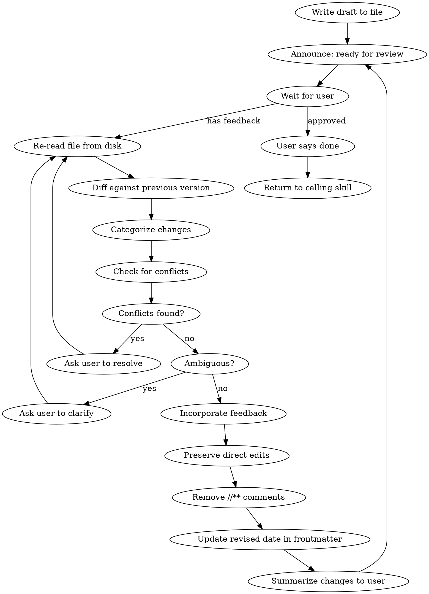

# Writing Docs

## Overview

Iterative human-in-the-loop document review. Write a markdown doc, wait for human feedback, incorporate changes, repeat until approved.

**Announce at start:** "Draft written to `<path>`. Ready for your review."

## The Review Loop



### Step by step

1. **Write the draft** to the agreed-upon file path.
2. **Announce:** "Draft written to `<path>`. Ready for your review. You can add `//** <comment>` annotations or edit the document directly, then let me know."
3. **Wait** for the user to respond.
4. If user says the doc is approved/done, **return to the calling skill**.
5. Otherwise, **re-read the file from disk** (never rely on cached content).
6. **Diff against your previous version** to identify all changes.
7. **Categorize changes:**
   - `//** <comment>` annotations: feedback to incorporate and then remove
   - Direct edits: changes the user made themselves -- **preserve these as-is**
8. **Check for conflicts and contradictions:**
   - Does a `//**` comment contradict a direct edit elsewhere?
   - Does a `//**` comment contradict another `//**` comment?
   - Does a direct edit conflict with or invalidate another section of the doc?
   - If **any** potential conflict or contradiction is detected, **ask the user to resolve it** before making changes.
9. If any `//**` comment is ambiguous, **ask the user to clarify** before making changes.
10. **Incorporate** `//**` feedback into the document.
11. **Preserve** all direct edits the user made.
12. **Remove** the `//**` comment annotations.
13. **Update** the `revised` date in frontmatter.
14. **Summarize** what changed in a brief message to the user.
15. **Go to step 2.**

### Comment convention

Users may provide feedback in two ways:

**`//**` comments** -- inline annotations the agent should incorporate and remove:

```markdown
## Architecture

The system uses a microservices approach. //** I think monolith is better here

Components communicate via REST. //** What about gRPC?
```

**Direct edits** -- changes the user makes to the document themselves. These are intentional and must be preserved. The agent should acknowledge them but not revert or rewrite them.

## Rules

- **Always re-read from disk.** Never assume your cached version is current.
- **Remove `//**` comments** after incorporating them. The revised doc should be clean.
- **Never revert direct edits.** If the user changed text directly, that's intentional.
- **Ask on conflicts.** If comments or edits introduce contradictions -- with each other or with existing doc content -- ask the user to resolve before proceeding.
- **Ask, don't guess.** If a comment is unclear, ask for clarification.
- **Summarize concisely.** After each revision, briefly list what changed. Don't restate the entire document.
