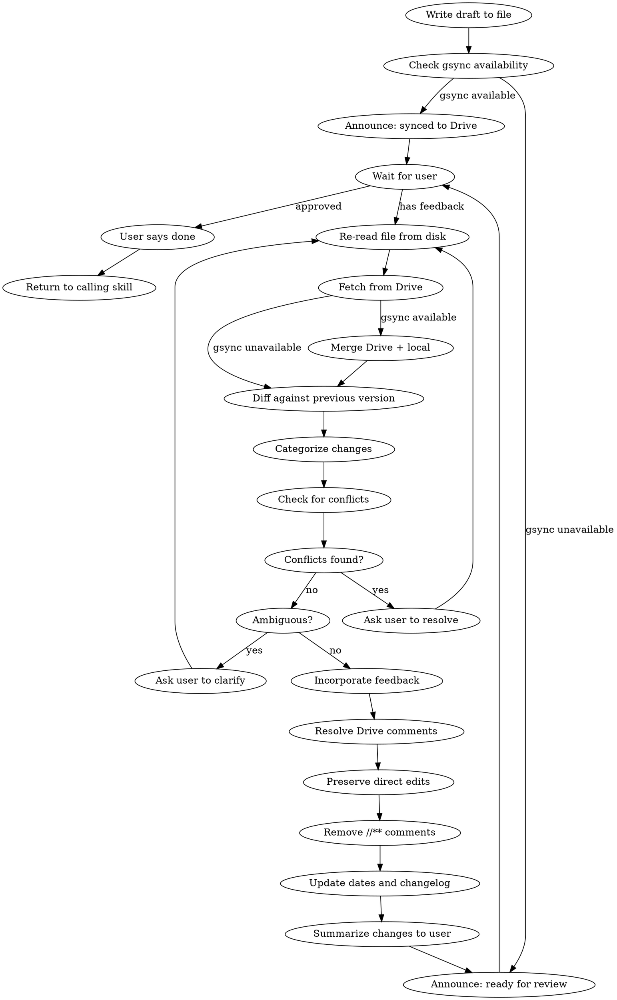

# Writing Docs

Iterative human-in-the-loop document review. Write a markdown doc, wait for human feedback, incorporate changes, repeat until approved.

## The Review Loop

### Step by step

1. **Write the draft** to the agreed-upon file path. Immediately after the `# Title`, include `*Created: YYYY-MM-DD | Last revised: YYYY-MM-DD*` (both set to today on first draft). A PostToolUse hook runs `gsync upload` — if the hook output contains a Drive link, include it in your announcement (first write only).
2. **Check gsync availability**: `npx gsync auth status`. See [Google Drive Sync](#google-drive-sync).
3. **Announce:**
   - gsync available: "Draft written to `<path>` and synced to Google Drive: `<link>`. You can review and comment in either place."
   - gsync unavailable: "Draft written to `<path>`. Ready for your review — add `//** <comment>` annotations or edit directly, then let me know."
4. **Wait** for user response. If approved/done, return to calling skill.
5. **Re-read the file from disk** — never rely on cached content.
6. **Fetch and merge from Drive** if gsync is available. See [Google Drive Sync](#google-drive-sync).
7. **Diff against your previous version** and categorize changes:
   - `//** <comment>` annotations and Drive comments: feedback to incorporate then remove.
   - Direct edits: intentional changes — **preserve as-is, never revert**.
8. **If comments or edits contradict each other or existing content**, ask the user to resolve before proceeding. If any `//**` comment is ambiguous, ask for clarification.
9. **Apply changes**: if gsync is available, run `npx gsync comments resolve-all <path> -y` first (before writing), then incorporate feedback, preserve direct edits, remove `//**` annotations.
10. **Update dates and changelog**: update "Last revised" date below the title to today. Append a changelog entry to the bottom of the document: `- YYYY-MM-DD: <one-line summary of changes>`. Create the `## Changelog` section on first revision if it doesn't exist.
11. **Summarize** what changed briefly. Go to step 3.

### Comment convention

Users provide feedback in two ways:

- **`//**` comments** — inline annotations to incorporate and remove: `Some text. //** suggestion here`
- **Direct edits** — changes the user made themselves. Intentional; never revert.

## Google Drive Sync

`gsync` syncs markdown files to Google Drive. Upload is handled automatically by a PostToolUse hook on Write/Edit — **never run `gsync upload` manually**. The skill only handles availability detection, fetching, and merging.

### Availability check (step 2)

Run `npx gsync auth status`. Authenticated if the first line says "Authenticated" (ignore token expiry warnings — gsync auto-refreshes). If it fails or is not found, skip all gsync behavior silently for the session.

### Fetch and merge (step 6)

After re-reading the local file (step 5), before diffing (step 7):

1. `npx gsync view <path> --format markdown` — get Drive content.
2. `npx gsync comments <path> --json` — get comments (treat as `//**` annotations).
3. **Merge**: use whichever side changed as base. If both changed the same section with contradictions, ask the user which to keep.

If any gsync command fails, skip remaining gsync steps and proceed with the local file.
